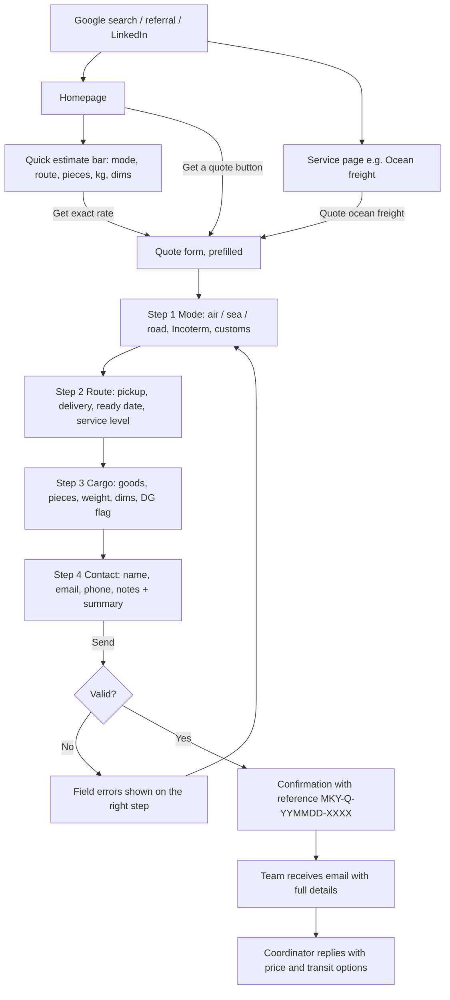
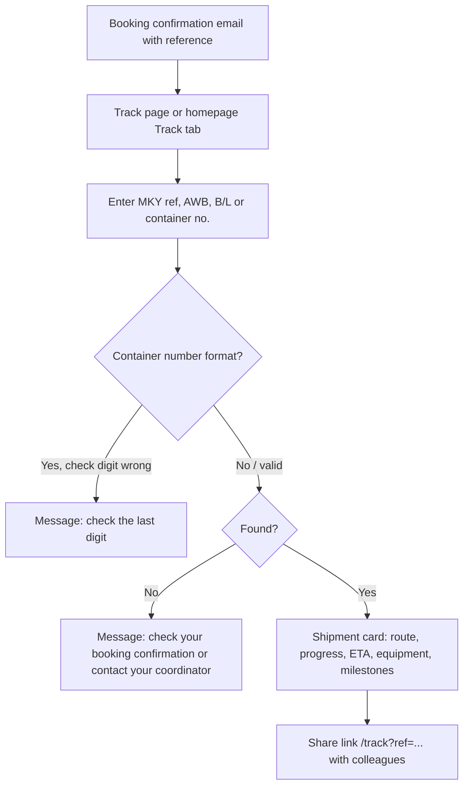
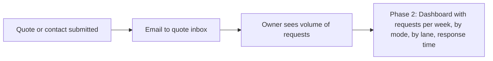
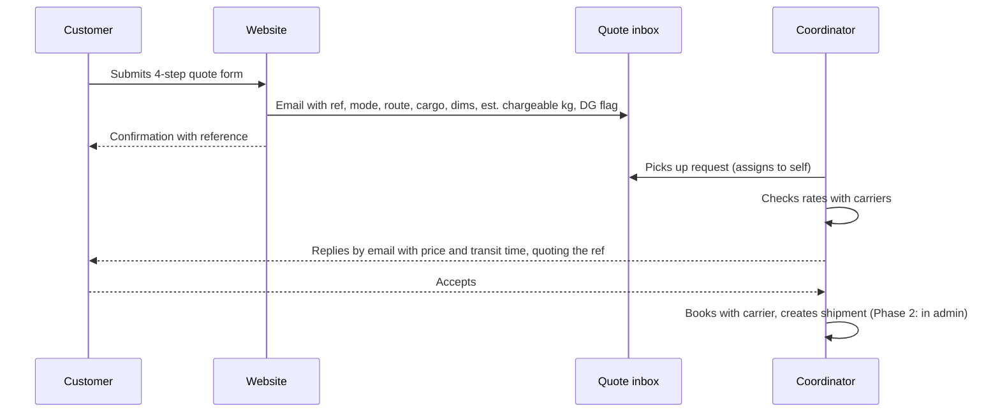
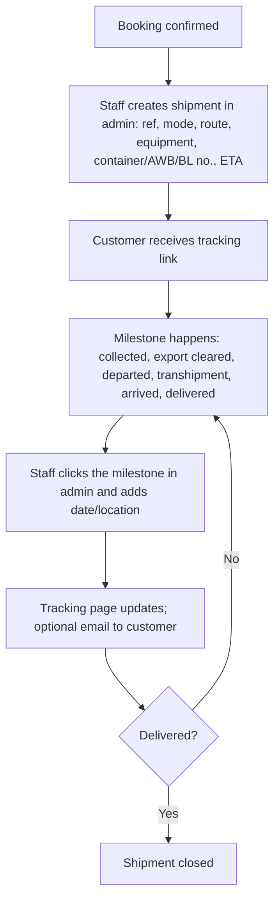

# User journey flows

**Project:** MKY Global Forwarding website
**Author:** Ogu Emmanuel
**Status:** Draft for review with Medhat and Aakash

This document describes how each type of user moves through the website and the work behind it. Flows marked **Live** work in the current build. Flows marked **Phase 2** need the admin area described in [`04-ui-ux-brief.md`](04-ui-ux-brief.md).

---

## 1. Who uses the site

| Role | Who they are | What they want | How often |
|---|---|---|---|
| **Customer** | Importers, exporters and traders who need cargo moved (often SMEs), plus consignees waiting for goods | A price, a booking, and to know where their cargo is | Occasionally to weekly |
| **Owner** | MKY management (Medhat) | More enquiries, a credible brand, a view of what's coming in | Daily to weekly |
| **Staff** | MKY coordinators, operations and customs agents | Complete quote requests, fewer "where is my cargo?" calls, a quick way to update status | Daily |

---

## 2. Customer flows

### 2.1 Get a quote (Live)

The most important flow on the site. A customer can enter from three places, and all three end in the same 4-step form.

**Key moments**

| Step | What the customer sees | Why it matters |
|---|---|---|
| Quick estimate | Live volume, actual and chargeable weight (or revenue tonnes for sea) | Sets expectations before they ask, and shows expertise |
| Steps 1 to 3 | One topic per step, progress bar, live chargeable weight in step 3 | Keeps a long form manageable |
| Step 4 | A summary of everything entered | Lets them check before sending |
| Confirmation | Reference number and the email the quote will go to | Reassurance; the reference is used in any follow-up |

**Edge cases**

- Missing or invalid fields: the form stops on that step and shows a plain message ("Enter the total weight in kg").
- Dangerous goods ticked: the email flags **DG: YES** so staff ask for the safety data sheet.
- Network error on send: "We couldn't send your request. Check your connection and try again, or email us directly."
- Spam bots: a hidden honeypot field drops automated submissions silently.

### 2.2 Track a shipment (Live with demo data; real data in Phase 2)

**Today:** the tracker returns demo shipments (`MKY-DEMO-001`, `MKY-DEMO-002`).
**Phase 2:** staff create and update shipments (flow 4.2), or tracking connects to MKY's system or a carrier API.

### 2.3 Learn and compare (Live)

1. Customer lands on a service page or the Tools page from search ("chargeable weight calculator", "what is FCA").
2. Uses the calculator or Incoterms explorer.
3. Sees "Get an exact rate" or "Quote air freight" and moves into flow 2.1.

Purpose: useful content that brings in search traffic and turns into quote requests.

### 2.4 Contact without a quote (Live)

| Channel | Where | What happens |
|---|---|---|
| Contact form | `/contact` | Topic picked (existing shipment, new business, customs, partnership, other); email to the team with reference `MKY-C-...` |
| WhatsApp | Floating button on every page | Opens chat with MKY's number |
| Phone / email | Quote page sidebar, contact page, footer | Direct |

### 2.5 Returning customer (Phase 2)

1. Customer has an ongoing shipment and receives milestone emails.
2. Clicks the link in the email and lands on `/track?ref=...` with the result already shown.
3. Later: optional customer portal with documents (invoices, B/L, AWB) per shipment.

---

## 3. Owner flows

### 3.1 See what's coming in (Live via email; dashboard in Phase 2)

**Today:** every request arrives as an email with a reference, so the inbox is the record.
**Phase 2 dashboard shows:**

- New quote requests this week and month
- Split by mode (air / sea / road) and top lanes
- Average time from request to first reply
- Requests won vs lost (staff mark the outcome)

### 3.2 Keep the site credible (Live)

1. Owner sends Ogu updates: team photos, testimonials, new accreditations, routes.
2. Developer updates `src/content/site.ts`, pushes a feature branch, and the preview deploys.
3. Owner checks the preview link and approves.
4. Change is merged to `main` and goes live.

**Phase 2:** a content management screen lets the owner edit these directly (flow 4.3).

### 3.3 Monthly review (Phase 2)

1. Owner opens the dashboard or receives a monthly email report.
2. Reviews quote volume, conversion and search traffic.
3. Decides what content to add next (new lane page, new guide).

---

## 4. Staff flows

### 4.1 Handle a quote request (Live)

**What staff get in each email:** reference, mode, route, service level, Incoterm, customs needed, ready date, goods, HS code, equipment, pieces, total weight, dimensions, estimated chargeable weight, dangerous goods flag, contact details and notes.

**Agreed rules (to confirm with Medhat):**

- Reply within the promised time shown on the site (placeholder: "within X working hours").
- Always quote the `MKY-Q-` reference in the subject line.
- If dangerous goods is ticked, request the MSDS before pricing.

### 4.2 Update shipment status (Phase 2)

Standard milestone codes already used by the tracker: `BKD` booking confirmed, `PUP` collected, `EXC` export cleared, `DEP` departed, `TSH` transhipment, `ARR` arrived, `DLV` delivered.

### 4.3 Update website content (Phase 2)

1. Staff with editor rights log in to the admin.
2. Edit team members, testimonials, stats, lanes or service details.
3. Save as draft, preview, publish.

### 4.4 Triage contact enquiries (Live)

| Topic chosen by customer | Who picks it up |
|---|---|
| An existing shipment | The shipment's coordinator |
| New business enquiry | Sales / owner |
| Customs question | Customs agent |
| Partnership | Owner |
| Something else | Whoever monitors the inbox |

Routing is manual today (one inbox). Phase 2 can send each topic to a different address.

---

## 5. Touchpoint map

| Stage | Customer | Owner | Staff |
|---|---|---|---|
| Awareness | Search, LinkedIn, referral, service pages, tools | Content updates | |
| Consideration | Services, about, accreditations, testimonials | Supplies proof points | |
| Enquiry | Quick estimate, quote form, WhatsApp, contact | Sees request volume | Receives complete request |
| Booking | Email with price, accepts | | Prices, books, creates shipment |
| In transit | Tracking page, milestone emails | | Updates milestones |
| After delivery | Repeat quote, testimonial request | Reviews results | Closes shipment, asks for feedback |

---

## 6. What needs a decision

| Question | Affects |
|---|---|
| Which inbox receives quotes, and the promised reply time | Flow 2.1, 4.1 |
| How tracking data is entered (admin page, existing system, carrier API) | Flow 2.2, 4.2 |
| Whether customers get milestone emails | Flow 2.5, 4.2 |
| Who has admin access and with what rights | Flows 3.x, 4.2, 4.3 |
| Whether contact topics route to different people | Flow 4.4 |

These map to questions D and E in the list sent to Medhat.
